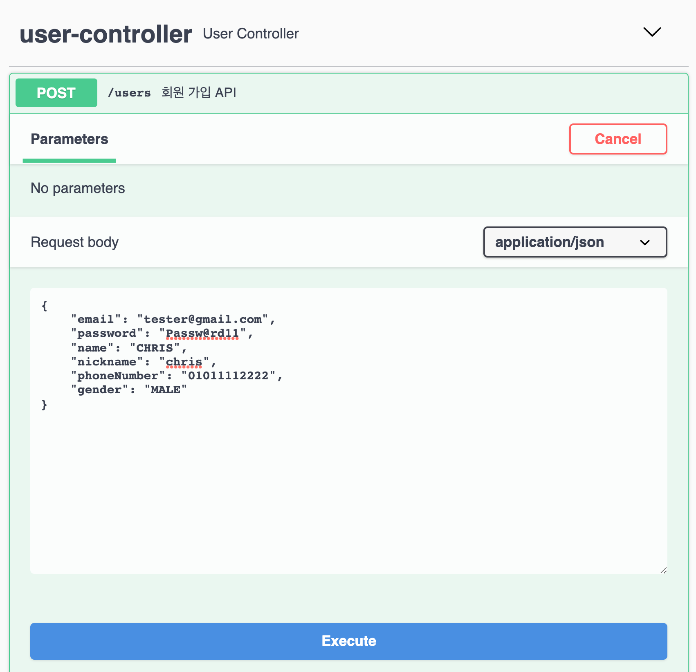
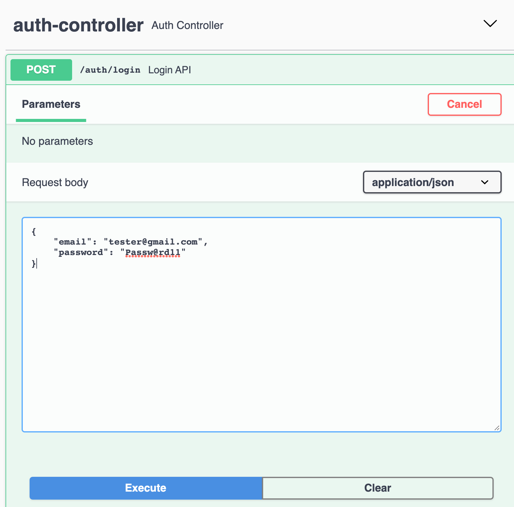
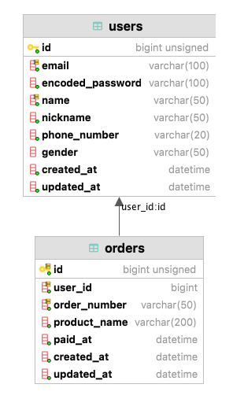
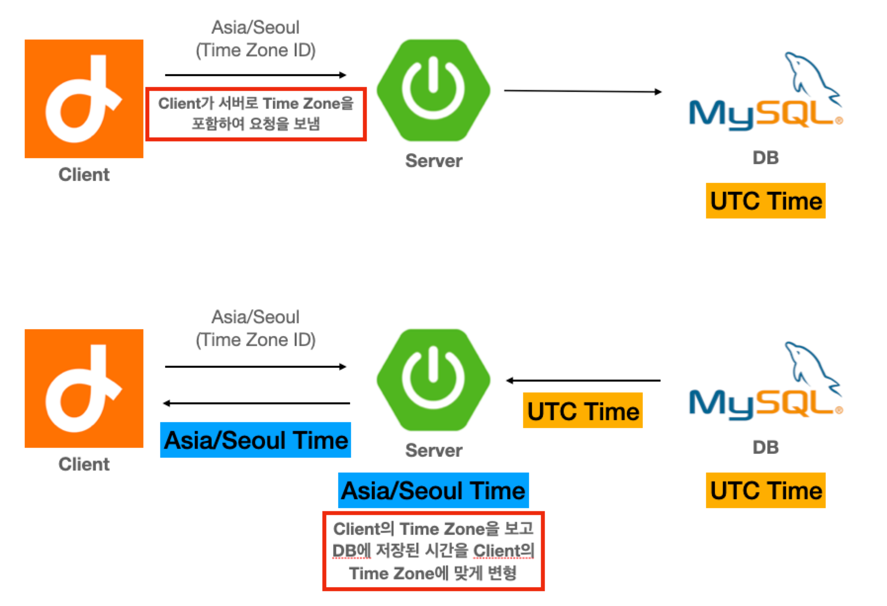

:toc: left

= API Server

== Specification

* Language: Java 11
* Framework: Spring Boot 2.5
** WebMVC, Security, Data JPA(+ Querydsl), Flyway
* Database: MySQL 8.0

== 실행

=== 데이터베이스 (Docker)

[source,sh]
----
$ docker-compose -f ./docker-compose.yml up -d
----

=== Application Build

[source,sh]
----
$ ./gradlew build
----

=== Application Start

[source,sh]
----
$ ./gradlew bootRun

# 또는 빌드 후
$ java -jar ./build/libs/hw-0.0.1-SNAPSHOT.jar
----

== API document

서버 실행 후 http://localhost:8080/swagger-ui/index.html 접속

Spring Security로 인해 API 사용 시 로그인 뒤에 사용해야한다

* 회원가입

요청 예제

[source,json]
----
{
    "email": "tester@gmail.com",
    "password": "Passw@rd11",
    "name": "CHRIS",
    "nickname": "chris",
    "phoneNumber": "01011112222",
    "gender": "MALE"
}
----

* 로그인

[source,json]
----
{
    "email": "tester@gmail.com",
    "password": "Passw@rd11"
}
----

== 데이터 모델링

* **users**
** `회원` 에 대한 데이터를 저장하는 테이블

* **orders**
** `주문` 에 대한 데이터를 저장하는 테이블
** 주문 생성에 대해 겹치지 않는 시간 기준을 사용하고자 주문 번호(order_number) 외에 `id` 를 PK로 사용
** MySQL 8.0의 `TIMESTAMP` type의 2038년 까지만 표현 가능하기 때문에 시간에 대한 컬럼은 9999년까지 표현 가능한 `DATETIME`
type을 사용함 (link:https://dev.mysql.com/doc/refman/8.0/en/datetime.html[참고])
** **제품명**에서 emoji를 포함한 문자들을 저장하기 위해 character set을 `utf8mb4` 를 사용해야함
*** MySQL 8.0에서는 기본 character set으로 `utf8mb4` 를 사용 (link:https://dev.mysql.com/doc/refman/8.0/en/charset.html[참고])

== 요구사항 구현

기능 구현은 크게 `인증/인가`, `데이터 조회` 로 나누어 보고 아래와 같이 접근하였다.

=== 인증

* 핵심 문제

로그인, 로그아웃 기능 및 요청 인가 기능 구현

* 문제 해결 전략

** `Spring Security` 를 사용하여 Session 기반 Security 기능을 구현
** Custom `Authentication`, `Authentication Filter` 를 구현하여 다른 인증 방식이 추가되더라도 유연하게 적용할 수 있도록 함
** 편의상 CSRF 설정은 disable 하였음 / Authority, Role은 구현하지 않음

=== 데이터 조회

* 핵심 문제

** **greatest-n-per-group**
*** 회원 목록 조회 시 각 회원의 마지막 주문 정보를 같이 조회해야함

** **pagination**
*** 주문 목록 및 회원 목록 조회

* 문제 해결 전략

** 회원의 마지막 주문 정보를 조회하기 위해 group by 쿼리 시 `마지막 주문` 임을 판단하기위해 auto increment `id` 컬럼을 사용함
*** PK인 `id` 를 사용하여 빠르게 처리할 수 있도록 함

** pagination 처리 시 offset 사용으로 인한 성능 저하를 고려함
*** 회원의 주문 목록 조회 시에는 offset을 사용하지 않고 infinite scroll(조회한 데이터 목록의 마지막 ID를 통해 다음 데이터 목록을 요청) 형식의 API를 설계
*** 회원 검색 조회 시에는 `offset` 을 사용하되 `covering index` 를 사용하여 일반적인 페이지 번호 기반의 pagination으로 구현

** 추가적으로 쓰기 전용 DB의 부하를 낮추기 위해 `AbstractRoutingDataSource` 를 사용하여 `@Transactional` 어노테이션의 `readOnly` 옵션이 **true**인 경우 읽기 전용 DB를 통해 데이터를 조회하도록 설정함
*** `com.idus.hw.config.jpa.WriteReadOnlyRoutingDataSource`

* 개선해야할 점
** 각 조회 기능에 대해 DB 성능을 고려하였으나 한 API를 응답하기 위해 여러 DB 쿼리를 호출하고 있음
*** DB 쿼리를 줄이기 위해서는 JPA + Querydsl로는 한계가 있음 (Subquery를 사용한 쿼리 작성에 한계)
*** 동일한 연산을 하나의 쿼리로 줄이기 위해 String을 사용한 Raw SQL 쿼리 또는 link:https://github.com/Blazebit/blaze-persistence[Blaze-Persistence]와 같은 다른 library를 활용하는 방식이 있음
*** 회원의 마지막 주문 조회 시, 복잡한 쿼리를 없애고 읽기 성능을 향상 시키기 위해 회원의 최신 주문 데이터는 따로 관리하는 방식(Read Model)도 고려할만 함

=== 그 외

* 시간 처리

DB에는 UTC를 기준으로 시간을 저장하고 서버는 클라이언트의 Time Zone 기준으로 시간을 변형하여 응답
